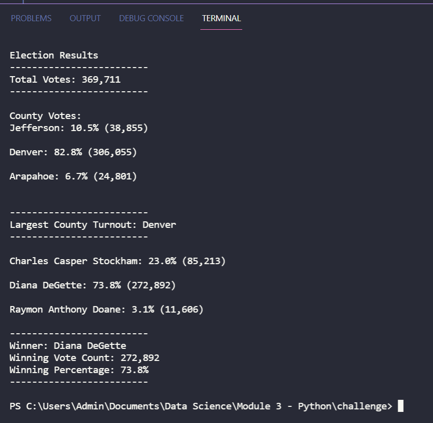
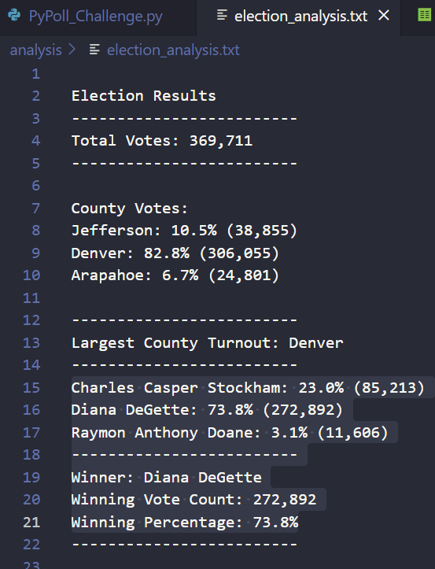

# Election_Analysis

## Overview of the Project

### Project Background:

The purpose of this analysis is to help a Colorado Elections Board employee complete the election audit of a recent local congressional election. The initial analysis required computation of the following:

- Calculate the total number of votes cast
- Create a complete list of candidates who received votes
- Calculate the number of votes each candidate received 
- Calculate the percentage of votes each candidate won
- Determine the winner of the election based on popular vote

### Purpose
The election commission has requested some additional data to complete the audit:

- Calculate the voter turnout for each county
- Calculate the percentage of votes from each county out of the total count
- Determine the county with the highest turnout

## Resources
- Data Source: [election_results.csv](Resources/election_results.csv)
- Software: Python 3.6.1, Visual Studio code, 1.61.2

## Election Audit Analysis and Results

For this analysis, a Python code [PyPoll_Challenge.py](/PyPoll_Challenge.py) was updated using For loops and conditional statements to find all the requested results. A for loop was used to get the list of counties from the dataset.  Then a decision statement was used to check if a county exists in the county list. If county did not exist in the list, then the code began tracking the county votes. Another conditional statement was used to determine the winning county. 

The election results were printed on the Python terminal:
   

The election results were also sent to an output file called [election_analysis.txt](analysis/election_analysis.txt):

The analysis of the election shows that:

- Total of 369,711 votes were cast.
- There are 3 counties in the precinct:
	- Jefferson County
	- Denver county
	- arapahoe County
- Breakdown of votes by 3 counties in the precinct are as follows:
	- Jefferson County received 10.5% of the vote and 38,855 number of votes  
	- Denver County received 82.8% of the vote and 306,055 number of votes
	- Arapahoe County received 6.7% of the vote and 24,801 number of votes 
- Denver county had the largest number of votes (306,055) casted

- There were three candidates running in this election: 
	- Charles Casper Stockham 
	- Diana DeGette 
	- Raymon Anthony Doane
- Charles Casper Stockham received 23.0% of the vote and 85,213 number of votes
- Diana DeGette received 73.8% of the vote and 272,892 number of votes
- Raymon Anthony Doane received 3.1% of the vote and 11,606 number of votes

- Diana DeGette was declared as the winner of the election who received 73.8% of the vote and 272,892 total number of votes

## Election Audit Summary

The Python script created for completing the election audit can be used for any election with minor modifications. Auditing election results at a state-level or even at a country level can be accomplished by adding additional for loops and conditional statement.  Additional variables would need to be created to store and track state-level election vote count information.  The existing for loop which is used to read rows from the reader can be modiefied by adding conditional statements to check and track state-level vote counts, similar to  what we did for tracking county-level vote counts.  A new for loop would need to be written to print the output to the terminal and to the file for displaying state-level vote counts. The for loop would include conditional statements to determine the state-level winner, similar to how county level winner was determined.